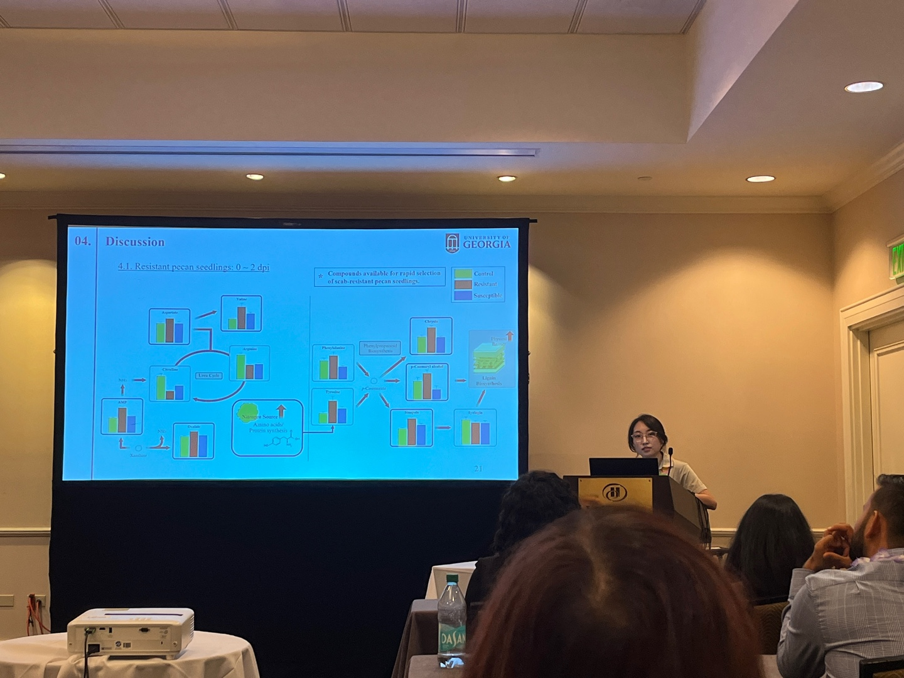

## Seminars & Oral Presentations

* "Discovery of early biomarkers for the scab resistance of pecan seedlings using metabolomic analysis combined with machine learning algorithms"  
  American Society for Horticultural Science (ASHS), Honolulu, Hawaii (Sep 2024)  
  {: style="width:50%; height:auto;"}
* "Metabolomics with machine learning: Application for Food Science and Technology"  
  FDST 3000, University of Georgia, Athens, GA (Sep 2024)
* "Metabolomic analysis with machine learning algorithms enables the evaluation of postharvest color stability in different pecan varieties”  
  American Chemistry Society (ACS), New Orleans, LA (March 2024)  
  {: style="width:50%; height:auto;"}
* “Pathway-based metabolomics reveals the biosynthesis of key flavor compounds in apple”  
  US-Korea Conference (UKC), Dallas, TX (Aug 2023)  
  {: style="width:50%; height:auto;"}
* “Determination of Urolithin Related Metabolites in Human Plasma by LC-MS Analysis – Potential Biomarkers for Pecan Consumption”  
  36th Southern Section of AOAC INTERNATIONAL (SSAOAC), Atlanta, GA (Apr 2023)  
  {: style="width:50%; height:auto;"}

## Poster Presentations

* "Discovery of biomarkers for postharvest pecan color stability using metabolomics and machine learning algorithms"  
  American Society for Horticultural Science (ASHS), Honolulu, Hawaii (Sep 2024)
* "Metabolomics Approach for Flavor Biosynthetic Pathway Discovery in Different Apple Cultivars Grown in Korea"  
  19th Annual Conference of Metabolomics Society (MetSoc), Osaka, Japan (Jun 2024)
* "

  
* “Determination of Urolithin Related Metabolites in Human Plasma by LC-MS Analysis – Potential Biomarkers for Pecan Consumption"  
  36th Southern Section of AOAC INTERNATIONAL (SSAOAC), Atlanta, GA (Apr 2023)

## CV
[Link to CV](../files/CV_minjeong_kang.pdf)

