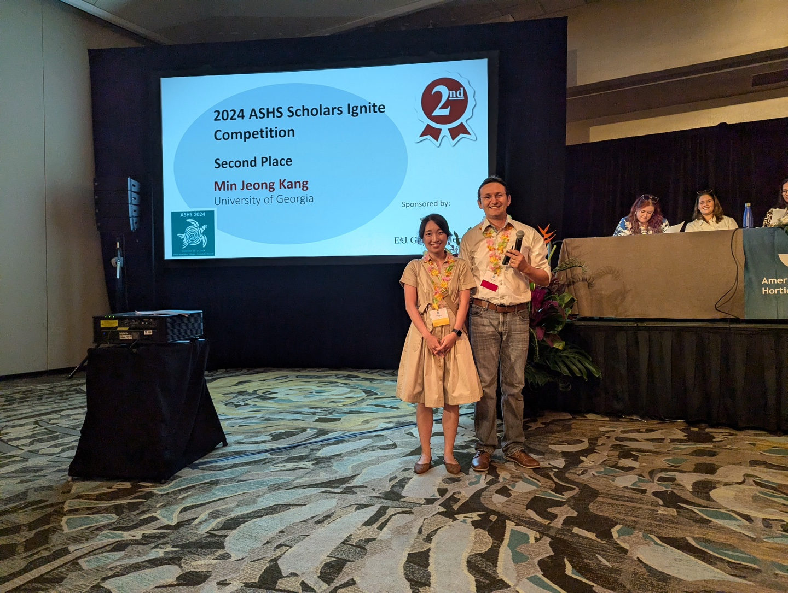

<table style="width: 100%;">
  <tr>
	<td style="width: 90%; border-bottom:0px;"><h1>Min Jeong Kang</h1></td>
	<td style="width: 10%; border-bottom:0px;"></td>
  </tr>
</table>

Hello! I am a 5th year Ph.D. candidate in the Food Science and Technology Department at the University of Georgia.

My research interests are Food Metabolomics, using Machine Learning Algorithms to select biomarkers, and Flavoromics. My recent work involves evaluating pecan quality, looking at biomarkers for desirable color and scab resistance using metabolomics and machine learning. For my master's thesis, I mainly worked on sensory evaluation and studied how to differentiate whole wheat flour quality through enzyme treatments, milling methods, and cultivar genotypes. I have conducted sensory analyses, including both consumer test and quantitative descriptive analysis (QDA) with diverse food products.

**<a href="files/CV_minjeong_kang.pdf">Curriculum Vitae</a>**

 

**Recent Updates:**

* I was awarded as the second place in 2024 ASHS Scholars Ignite Competition at Hawaii!! 

* Currently, I'm working on my second and third chapter titled "Discovery of early biomarkers for the scab resistance of pecan seedlings using metabolomic analysis combined with machine learning algorithms" and "Discovery of mature biomarkers for scab resistance of pecan tree leaves using metabolomics and machine learning". 
  
 

**Contact Information:**

Email: MinJeong.Kang@uga.edu
